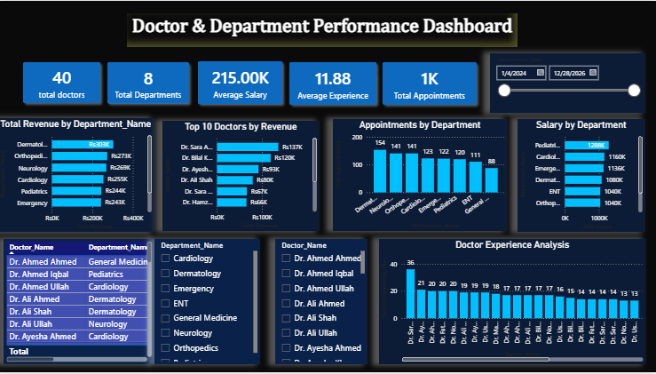
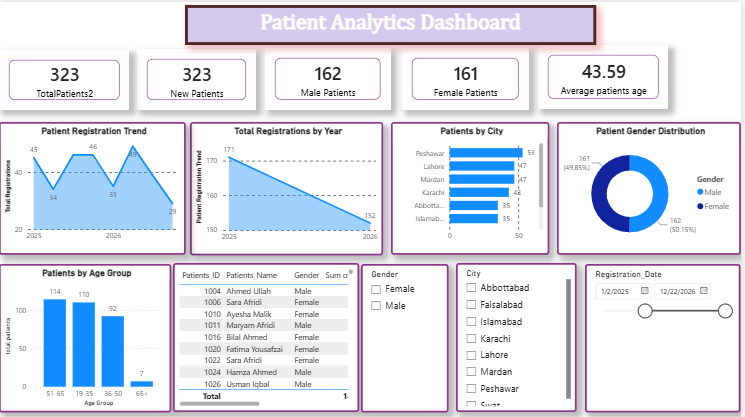

# 🏥 Hospital Management Analytics Dashboard

## 📌 Project Overview

This project demonstrates an end-to-end Data Analytics workflow using SQL (MySQL), Microsoft Power BI, and Microsoft Excel.

The objective of this project is to analyze hospital operations, patient records, doctor performance, appointments, and financial performance using interactive dashboards and business intelligence techniques.

---

## 🛠 Tools Used

- SQL (MySQL)
- Microsoft Power BI
- Microsoft Excel

---

## 📊 Dashboards

- Executive Dashboard
- Patient Analysis Dashboard
- Doctor Performance Dashboard
- Financial Analytics Dashboard

---

## ✨ Key Features

- Solved 50+ SQL Business Queries
- Built 4 Interactive Power BI Dashboards
- Created KPI Cards and DAX Measures
- Performed Revenue Analysis
- Analyzed Doctor Performance
- Analyzed Patient Trends
- Created Financial Reports
- Applied Data Modeling and Relationships
- Added Interactive Slicers and Filters

---

## 📂 Project Files

- Power BI Dashboard (.pbix)
- SQL Queries (.sql)
- Excel Dataset
- Dashboard Screenshots

---

## 👨‍💻 Author

**Muhammad Junaid Khawar**

Aspiring Data Analyst

---

# 📷 Dashboard Screenshots

## 🏥 Hospital Performance Dashboard

---

## 👨‍⚕️ Doctor & Department Dashboard

---

## 💰 Financial Analytics Dashboard

---

## 👥 Patient Analytics Dashboard

